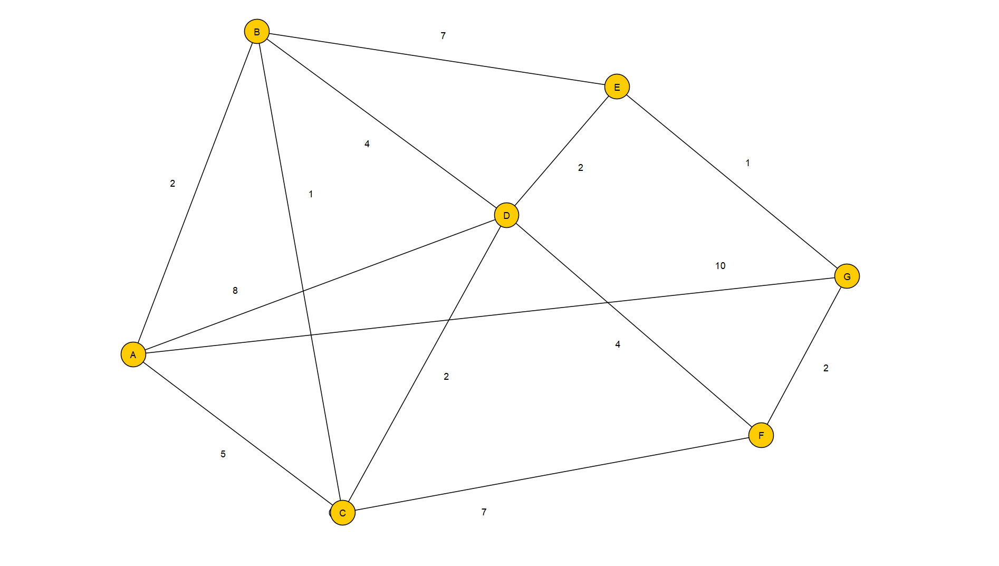

# Graphenalgorithmen – Beispielimplementierung

Dieses Projekt enthält eine einfache Implementierung eines Graphen sowie mehrere grundlegende Algorithmen zur Traversierung und Pfadfindung.

Implementiert wurden:

* Breitensuche (Breadth-First Search, BFS)
* Tiefensuche (Depth-First Search, DFS)
* Dijkstra-Algorithmus
  
Das Projekt dient als **Lern- und Demonstrationsbeispiel**, um zu zeigen, wie diese Algorithmen funktionieren und wie sie in einem Programm umgesetzt werden können.

---

## Inhalt des Projekts

Das Projekt besteht aus:

* einer einfachen Graph-Datenstruktur
* einem Beispielgraphen
* Implementierungen der wichtigsten Such- und Pfadalgorithmen
* Beispielaufrufen zur Demonstration der Funktionsweise

---

## Implementierte Algorithmen

### Breitensuche (BFS)

Die Breitensuche durchsucht einen Graphen **Schicht für Schicht**.

Eigenschaften:

* verwendet eine Queue (Warteschlange)
* besucht zuerst alle direkten Nachbarn eines Knotens
* findet den kürzesten Weg in **ungewichteten Graphen**

---

### Tiefensuche (DFS)

Die Tiefensuche durchsucht den Graphen **möglichst tief entlang eines Pfades**, bevor sie zurückgeht.

Eigenschaften:

* verwendet Rekursion oder einen Stack
* eignet sich gut, um **alle Knoten eines Graphen zu erkunden**

---

### Dijkstra-Algorithmus

Der Dijkstra-Algorithmus berechnet den **kürzesten Weg zwischen zwei Knoten in einem gewichteten Graphen**.

Eigenschaften:

* berücksichtigt Kantengewichte
* garantiert den kürzesten Pfad (bei nicht-negativen Gewichten)
* wird häufig in Navigationssystemen verwendet

---

## Beispielgraph

Die Algorithmen arbeiten auf einem kleinen Beispielgraphen:

Die Knoten sind über Kanten miteinander verbunden und können von den Suchalgorithmen durchlaufen werden.

---

## Ziel des Projekts

Ziel dieses Projekts ist es, ein besseres Verständnis für folgende Konzepte zu bekommen:

* Graphen und ihre Darstellung im Programm
* Traversierungsalgorithmen
* kürzeste Wege in Graphen
* grundlegende Algorithmik
